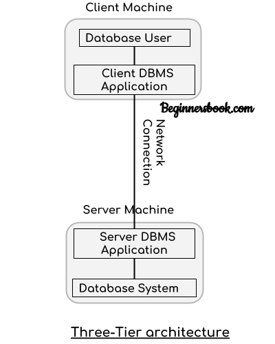
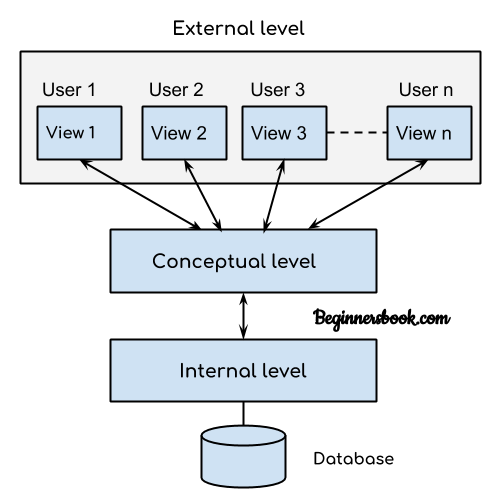
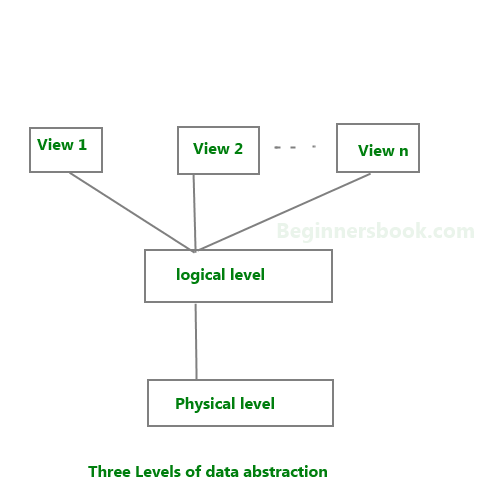

SQL
====
SQL full form -> Structured Query Language

Here I create little document on sql. How to it work. Nothing else.

Table of Contains 
---------------------
- [Database](#Database)
- [What Can Do SQL](#What_Can_Do_SQL)
- [SQL Statements](#SQL_Statements)

# Database
Database Management System or DBMS in short refers to the technology of storing and retrieving usersi data with utmost efficiency along with appropriate security measures.

## Two kind of Database on Structure.
1. Common Database.
2. Relational Database.

## Element of database.
1. Field ( Column )
1. Record ( Row )
1. Value ( Data )

### Field 
***Field is column of table***. Field can not contain full data. It store only one type data.

### Record
***Record is row of table***. Record contain full data. It store various type of data.

### Value
***Value is data***. Table cell contain the value or data.

## Key Field
Key field is a field which is base for create selecting, searching and relation of data base record.

***Three Kind of key field :***
1. Primary Key.
1. Composite Key.
1. Foreign Key.

### Primary Key
Primary key is a key which is unique and can select every record seperatly. 

### Composite Key
A key which is build with two or more than two key and select record speratly.

### Foreign Key
A key primary key which is use as a common key in another table called Foreign Key perspective to where is use as common key.

## Database Management System
Database management system is a system which is use for maintain database like create data, read data, update data, delete data.

***Database Management System Element :***
1. Data.
1. Hardware and Software.
1. User.
1. System.

***Database Management System for :***
1. Create Database.
1. Update Database.
1. Print Database.
1. Backup and Recovery Database.
1. Save Data
1. Retrieve Data.
1. Delete Data.
1. Secure Data.

## DBMS Architechture
The architechture of dbms depends on the computer system on which it runs. For example, in client-server dbms architecture, the database system at server machine can run serveral request made by client machine. We will understand this communication with the help of diagrams.

***Types of DBMS Architecture:***
1. Single tier Architecture.
1. Two tier Architecture.
1. Three tier Architecture.

### Single Tier Architecture.
In this type of architecture, the database is run available on the client machine, any request made by client dosen't require a network connection to perform the action on the database.

### Two tier Architecture
In two-tier architecture, the database system is present at the server machine and the DBMS application is present at the client machine, these two machine are connected with each other through a reliable as shown in the below diagram.

### Three tier Architecture
In three tier architecture, another layer is present between client and server machine. In this architecture client can not communicate directly with database systems present at the server machine, rather the client application communicates with server application and the server application internally communicates with the database system present at the server.

## DBMS Three Level Architecture Diagram
1. External Level ( View Level)
2. Conceptual Level ( Logical Level )
3. Internal Level ( Physical Level )

***Three Levels of Data Abstraction :***
1. View Level. ( Where use see and interact with data in Graphical way.)
1. Logical Level . ( Where exist field, record, value )
1. Physical Level. ( Store in memory as bit ) 

## DBMS Schema
Design of database is called the schema. Schema is of three types :
1. Physical Schema.
1. Logical Schema.
1. View Schema.

***Physical Schema :***
The design of a database at physical level is called physical schema, how the data stored in blocks of storage is described at this level.

***Logical Schema :***
Design of database at logical level is called logical schema, programmers and database adminstrators work at this level, at this level data can be described as certain types of data records gets stored in data structures, however the internal details such as implementation of data structure is hidden at this level ( available at physical level ).

***View Schema :***
Design of database at view level is called view schema. This generally describes end user interaction with database systems.

## What_Can_Do_SQL
1. SQL can execute queries against a database.
1. Retrieve data from a database.
1. Insert  records in a database.
1. Update records in a datbase.
1. Delete record from a database.
1. Create new database.
1. Create new tables in a database.
1. Create stored procedures in a database.
1. Create views in a database.
1. Set permisions on tables, procedures and views.

## SQL_Statements
Most of the action you need to perform on a database are done with SQL statements. ***SQL keywords are not case sensitive***. Some database systems requires a semicolon at the end to each SQL statement. Semicolon is standard way to seperate each sql statement in database system that allow more than one SQL statement to be executed in the same call to the server.

## DBMS Instance 
The data store in databse at a particular moment of time is called instance of database. Database schema defines the variable declarations in tables that belong to a particular database; the value of these variables at a moment of time is called the instance of the database.

## DBMS Languages 
DBMS languages are used to read, update and store data in a database. There are several such languages that can be used this purpose; one of them is SQL ( Structure Query Language );

***Type of DBMS Languages :***
1. DDL ( Data Defination Language )
1. DCL ( Data Control Language )
1. DML ( Data Manipulation Language )
1. TCL ( Transaction Control Language )

### DDL Data Defination Language
DDL is used for specifying the database schema. It is used for creating tables, schema, indexs, constraints etc. in database. Lets see the operation that we can perform on database using DDL : 

- CREATE - to create the database instance.
- ALTER - to alter the structure of database.
- DROP - dtrop database instance.
- TRUNCATE - to delete tables in a database instance.
- RENAME - rename database instance.
- DROP - to drop objects from database such as tables.
- COMMENT - to comment

### DML Data Manipulation Lanuages 
DML is used for accessing and manipulating data in a database. The following operations on database comes under DML : 
- SELECT - to read record from tables.
- INSERT - to insert record in the tables.
- UPDATE - update the data in tables.
- DELETE - delete all the record from database.

### DCL Data Control Language
DCL is used for granting and revoking user access on database -
- GRANT - to grant access to user.
- REVOKE - to revoke access from user.

### Transaction 
The changes in the database that we made using DML commands are either performed or rollbacked using TCl.
- COMMIT - to persist  the changes made by DML  command in database.
- ROLLBACK - to rollback changes made to the database.

***Some of the most important sql command :***
1. SELECT - extracts data from database.
1. update - update data in a database.
1. delete - deletes data from a database.
1. insert into - insert new data into the database.
1. create database - creates a new database.
1. alter database - modifies a database.
1. create table - creates a new table.
1. alter table - modifies a table.
1. drop table - deletes a table.
1. create index - create an index (search key)
1. drop index - delete an index. 