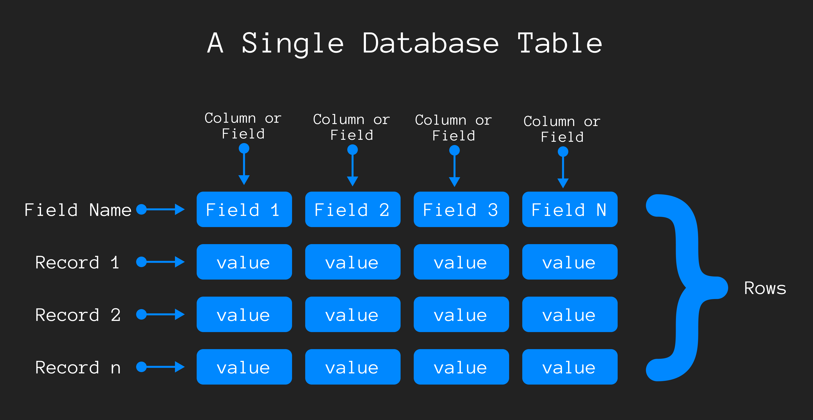

Basic
=====

Thsi file contains about : 

- **[What can Do SQL](#what-can-do-sql)**
- **[SQL Statements](#sql-statements)**
- **[Database Tables](#database-tables)**

## What Can Do SQL
1. SQL can execute queries against a database.
1. Retrieve data from a database.
1. Insert  records in a database.
1. Update records in a datbase.
1. Delete record from a database.
1. Create new database.
1. Create new tables in a database.
1. Create stored procedures in a database.
1. Create views in a database.
1. Set permisions on tables, procedures and views.

## SQL Statements
Most of the action you need to perform on a database are done with SQL statements. ***SQL keywords are not case sensitive***. Some database systems requires a semicolon at the end to each SQL statement. Semicolon is standard way to seperate each sql statement in database system that allow more than one SQL statement to be executed in the same call to the server.

***Some of the most important sql command :***
1. SELECT - extracts data from database.
2. update - update data in a database.
3. delete - deletes data from a database.
4. insert into - insert new data into the database.
5. create database - creates a new database.
6. alter database - modifies a database.
7. create table - creates a new table.
8. alter table - modifies a table.
9. drop table - deletes a table.
10. create index - create an index (search key)
11. drop index - delete an index. 

> 🔴 SQL is not case sensitive. The command `SELECT` and `select` is same. Both work as well.

> 🟠 Although sql is an ANSI/ISO standard, there are different version sql language.

## Database Tables
A database often contains one or more tables. Table made with "field" and "record". Table columns are called field and table rows are called record. Here in diagram : 

> 🔴 All value of a field must are same type but not require to all value data type same for a record.

> 🟢 Field contain a common type of value which is dose not represent anything  where row contains a various type of value which is represent something.
