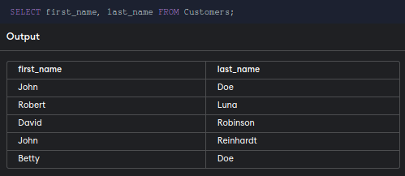
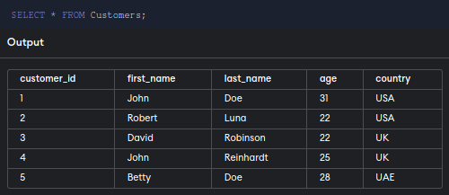

SELECT
======

## Syntax of Select Command
`SELECT` command use for select datas from database. Here basic syntax of `select` command.

```sql
SELECT column_name,column_name_2,column_3 FROM tables_name;
```

If need to select every columns then use `*` symbol instead of columns name.

Example : 
```sql
SELECT * FROM tables_name;
```

**Example here select two column in a row :**



**Example of select everything in tables :**




## SELECT DISNICT

Use select d